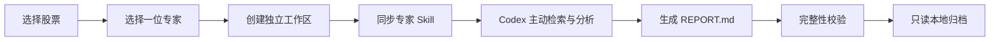
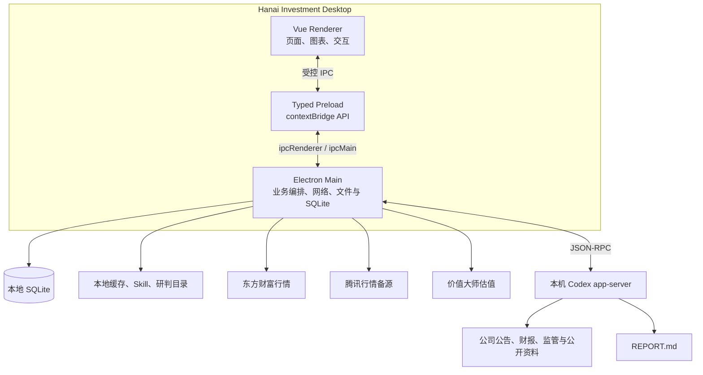

<div align="center">

# Hanai Investment

### 本地优先的 A 股行情、估值与 AI 专家研判桌面工作台

从市场发现、个股跟踪到深度研究，让行情数据、专家框架与 Codex Agent 在同一个桌面客户端中协同工作。

<p>
  
  
  
  
  
  
  
</p>

<p>
  <a href="#overview">项目简介</a> ·
  <a href="#features">核心能力</a> ·
  <a href="#quick-start">快速开始</a> ·
  <a href="#architecture">技术架构</a> ·
  <a href="#data-and-privacy">数据与隐私</a> ·
  <a href="#contributing">参与贡献</a>
</p>

</div>

---

<a id="overview"></a>

## 项目简介

Hanai Investment 是一个面向个人投资研究场景的桌面客户端。它将 A 股近实时行情、证券检索、自选分组、个股基本面与估值信息，和基于本机 Codex CLI 的深度研究 Agent 组合在一起。

它解决的不是“再做一个行情网站”，而是把完整的研究链路收进一个本地工作台：

```text
观察市场 → 发现标的 → 加入自选 → 查看详情 → 选择专家 → 主动调研 → 阅读报告 → 本地归档
```

项目遵循五个核心原则：

| 原则 | 含义 |
|---|---|
| **本地优先** | 自选、配置、任务记录、执行过程和研判报告默认保存在用户本机 |
| **数据有口径** | 页面明确展示数据来源、抓取时间、缓存状态和统计范围 |
| **专家即 Skill** | 每位专家是一套可读取、可审计、可同步的分析框架，而不是硬编码提示词 |
| **过程可审计** | Agent 的搜索、命令、分析摘要、工具调用和文件修改会形成持久化轨迹 |
| **成果可归档** | 每次研判拥有独立工作目录，最终报告以 `REPORT.md` 形式长期保存 |

> [!IMPORTANT]
> Hanai Investment 是个人研究工具，不接入券商交易，不自动下单，不承诺收益，也不提供确定性的买卖指令。

<a id="features"></a>

## 核心能力

### 1. 今日市场

用一个高信息密度的面板快速理解当日 A 股整体状态：

- 上证指数、深证成指、创业板指、沪深 300、科创 50、北证 50
- 沪深北市场宽度：涨停、上涨、平盘、下跌、跌停五档互斥统计
- 两市成交额与行情更新时间
- 行业 / 概念板块热力图，面积映射成交额，颜色映射涨跌幅
- 板块悬浮排名、成交额排序和成分股下钻
- 涨幅榜、跌幅榜、成交额榜和换手率榜

### 2. 自选与发现

面向日常跟踪设计的本地自选工作区：

- 定期同步 A 股证券主数据，支持代码、名称、全拼和拼音首字母检索
- 全局搜索可直接进入股票详情或加入指定自选分组
- 自选分组支持创建、重命名、删除和股票组间移动
- 默认分组始终保留；删除其他分组时，组内股票自动迁移到默认分组
- 默认按加入时间倒序展示，记录加入时价格并计算加入以来涨跌幅
- 列表展示近实时行情、成交额、换手率、市值、PE、PB 等指标

### 3. 股票详情

把盘中行情、历史走势、基本面和价值判断放在同一个页面：

- 分时走势、均价线与分时成交量
- 日 K、周 K、月 K 前复权行情及红绿成交量柱
- 开盘、最高、最低、昨收、成交量、成交额、换手率、量比等行情快照
- 市盈率、市净率、ROE、每股收益、每股净资产、营收、净利润等财务指标
- 主力净流入等资金信息（供应商有数据时展示）
- 价值大师估值、GF 评分、五维雷达图与历史价值曲线
- 从股票详情直接管理自选分组或发起大师研判

### 4. 专家中心

当前内置四套彼此独立的投资研究框架：

| 专家 | 核心方法 | 更适合研究 |
|---|---|---|
| **段永平** | 本分、消费者导向、组织授权、长期价值 | 商业模式、企业文化、长期竞争力与经营质量 |
| **混江龙** | 题材周期、市场情绪、龙头辨识、弱转强 | A 股题材交易、周期位置、板块效应与交易预案 |
| **查理·芒格** | 多元思维模型、逆向思考、认知偏误 | 决策审视、激励结构、风险识别与跨学科分析 |
| **沃伦·巴菲特** | 护城河、内在价值、资本配置、所有者视角 | 企业质量、管理层、复利能力与长期估值 |

每套能力由 `SKILL.md` 和经过整理的文本研究资料组成。发起研判时，应用会把所选专家 Skill 同步到任务自己的 `.agents/skills/` 目录，由 Codex 按标准 Skill 发现机制读取。

### 5. 大师研判

大师研判不是聊天窗口，而是一项有明确开始与结束的一次性研究任务：

1. 选择一只股票和一位专家。
2. 应用为任务创建独立本地工作区。
3. 同步所选专家 Skill，并生成当前任务的 `AGENTS.md`。
4. 通过 Codex app-server 创建独立线程。
5. Agent 主动检索公司公告、财报、监管披露和行业资料。
6. 客户端实时呈现研判对话与必要的工具活动摘要。
7. Agent 将唯一正式成果写入 `REPORT.md`。
8. 应用检查报告完整性，计算 SHA-256，并将任务转为只读归档。



研判报告至少覆盖：执行摘要、信息时点与来源、业务与竞争格局、财务质量、估值与关键假设、催化剂、核心风险、乐观 / 基准 / 悲观情景、持续验证清单和符合专家框架的最终判断。

### 6. 设置与诊断

- 自动检测本机 Codex CLI、版本、登录状态和账号信息
- 通过 app-server `model/list` 读取当前账号实际可用模型，不维护硬编码模型清单
- 记住已选择的模型，并把实际模型写入每次研判记录
- 展示行情源、估值源、主数据规模和更新时间
- 查看本地数据库、缓存、日志与研判归档占用空间
- 可单独清理行情或估值缓存，不影响自选与研判报告

## 产品边界

Hanai Investment 当前专注于“行情观察 + 单专家独立研判”。以下能力不在当前产品范围内：

- 券商账户接入、自动交易和实盘下单
- 收益保证、确定目标价或确定性买卖指令
- 多专家委员会、主持人终审或按人数投票
- 持续聊天、在已完成报告上追问或恢复旧会话
- 任务执行中人工插话、追加证据或修改 Agent 指令
- 云端账户、跨设备同步和团队协作空间

<a id="quick-start"></a>

## 快速开始

### 环境要求

| 依赖 | 最低要求 | 用途 |
|---|---:|---|
| Node.js | `22` | Electron 主进程、构建工具与 `node:sqlite` |
| pnpm | `8` | Monorepo 依赖管理 |
| Codex CLI | 建议最新版 | 大师研判与模型发现 |
| 网络 | 可访问行情源与公开网站 | 行情、估值和 Agent 调研 |

> 当前仓库提供源码开发与生产构建命令，尚未配置 macOS / Windows / Linux 的安装包发布流程。

### 1. 克隆并安装依赖

```bash
git clone https://github.com/hancao97/hanai-investment.git
cd hanai-investment

corepack enable
pnpm install
```

### 2. 准备 Codex CLI

```bash
npm install -g @openai/codex@latest
codex --version
codex login
```

如果暂时不安装 Codex，今日市场、自选、搜索和股票详情仍可使用；只有大师研判功能不可用。

### 3. 启动开发环境

```bash
pnpm dev
```

首次启动时，应用会：

1. 创建 `~/.hanai-investment/` 数据目录；
2. 初始化本地 SQLite 数据库；
3. 导入仓库内置专家 Skill；
4. 尝试连接 Codex app-server；
5. 在后台同步 A 股证券主数据。

### 4. 类型检查与生产构建

```bash
pnpm typecheck
pnpm build
```

构建产物位于 `packages/app/out/`。如需预览生产构建：

```bash
pnpm --filter @hanai/app preview
```

## 常用命令

| 命令 | 说明 |
|---|---|
| `pnpm dev` | 启动 Electron + Vite 开发环境 |
| `pnpm typecheck` | 检查渲染进程与主进程 TypeScript 类型 |
| `pnpm build` | 构建 Electron 主进程、Preload 和渲染进程 |
| `pnpm --filter @hanai/app preview` | 预览生产构建 |

<a id="architecture"></a>

## 技术架构

### 技术栈

| 层级 | 技术 |
|---|---|
| 桌面容器 | Electron 43、electron-vite 5 |
| 渲染层 | Vue 3.5、Pinia 3、Vue Router 4 |
| 图表与报告 | Apache ECharts 5、markdown-it |
| 语言与工程 | TypeScript 5.7、Vite 7、pnpm workspace |
| 本地数据库 | Node.js `node:sqlite`、WAL 模式 |
| Agent 运行时 | 本机 Codex CLI + app-server JSON-RPC |
| 搜索辅助 | pinyin-pro，本地代码 / 名称 / 拼音检索 |

### 进程关系



渲染进程不直接访问 Node.js、文件系统或外部数据源。所有敏感能力都经过 Preload 暴露的类型化 API 进入 Electron 主进程；窗口启用了 `contextIsolation` 并关闭了渲染进程 `nodeIntegration`。

### 仓库结构

```text
hanai-investment/
├── packages/
│   ├── app/                              # Electron 桌面客户端
│   │   ├── src/main/                     # 主进程、IPC、数据源、SQLite、Codex
│   │   ├── src/preload/                  # 类型化 contextBridge
│   │   ├── src/renderer/                 # Vue 页面、组件、状态与样式
│   │   └── src/shared/                   # 主进程 / 渲染进程共享类型
│   └── agents/                           # 内置专家 Skill
│       ├── duan-yongping-perspective/
│       ├── hunjianglong-perspective/
│       ├── munger-perspective/
│       └── warren-buffett-perspective/
├── prd/                                  # 产品需求与设计边界
├── package.json                          # Monorepo 命令入口
├── pnpm-workspace.yaml
└── README.md
```

### 研判工作区

每项任务都拥有独立目录：

```text
~/.hanai-investment/runtime/workdir/judgements/<task-id>/
├── AGENTS.md                             # 当前任务的边界与交付要求
├── RUN.json                              # 标的、专家、模型、状态与时间
├── activity.jsonl                        # 持久化执行轨迹
├── REPORT.md                             # 唯一正式研判成果
└── .agents/
    └── skills/
        └── <persona-id>/
            ├── SKILL.md
            └── references/...
```

任务同步 Skill 时会排除 `sources/`、`scripts/`、二进制资料和其他不需要进入运行时的文件，只保留实际分析需要的 Skill 与文本知识。

<a id="data-and-privacy"></a>

## 数据来源、缓存与口径

| 数据源 | 用途 | 策略与边界 |
|---|---|---|
| **东方财富** | 指数、市场宽度、板块、榜单、主数据、个股行情、财务指标、K 线与分时 | 主行情源；实时集群不可用时可退回延迟集群，界面标记为近实时快照 |
| **腾讯行情** | 日 / 周 / 月 K 线与分时 | 东方财富失败时的备源；缺少成交额时返回空值，不以 `0` 冒充真实数据 |
| **价值大师网** | 估值判断、GF 评分、五维能力与价值曲线 | 个人研究原型接口，日级缓存，未获得数据再分发授权 |
| **公开互联网** | 公司公告、财报、监管披露、行业研究等 | 由 Codex 在每次研判中主动检索，关键事实应在报告中附来源与日期 |

不同平台可能因证券范围、ST 口径、复权方式、数据时点和缓存策略产生差异。页面数据只能代表对应供应商在显示时间点返回的结果。

## 本地数据与隐私

应用业务数据默认保存在：

```text
~/.hanai-investment/
├── hanai.db                              # 自选、证券主数据、配置与研判索引
├── cache/
│   ├── market/                           # 行情缓存
│   └── valuation/                        # 估值缓存
├── personas/                             # 已导入专家 Skill
├── runtime/
│   ├── workdir/judgements/               # 研判工作区与报告
│   └── state/                            # 运行时状态
├── exports/                              # 本地导出目录
└── logs/                                 # 应用日志
```

- 不提供云同步，也没有项目自建的远程业务后端。
- 行情、估值和 Agent 联网研究会访问相应第三方服务。
- 清理缓存不会删除自选、专家 Skill 或研判报告。
- 外部网页链接会交给系统默认浏览器打开，不在 Electron 窗口内接管导航。
- 应用中显示的 Codex 账号和模型信息来自本机 Codex CLI。

### Agent 权限说明

研判任务当前以 Codex `danger-full-access` 沙箱配置和 `never` 审批策略运行，以保证无人值守研究不会被权限弹窗反复中断。应用通过任务级 `AGENTS.md` 要求 Agent 只在当前工作目录写文件，但该约束不能替代操作系统级沙箱。

因此，请只在可信设备和可信源码环境中运行本项目，并在投入真实研究资料前自行审查相关实现。后续版本计划增加更细粒度的可选权限模式。

## 故障排查

<details>
<summary><strong>设置页显示“未找到 Codex”</strong></summary>

先确认终端可以找到可执行文件：

```bash
which codex
codex --version
```

应用会检查当前 `PATH`，以及 `/opt/homebrew/bin`、`/usr/local/bin`、`~/.local/bin` 和 `~/.npm-global/bin` 等常见位置。安装或修复后，在“设置与诊断”中重新检测。

</details>

<details>
<summary><strong>Codex 已安装，但大师研判不可用</strong></summary>

确认本机已经登录：

```bash
codex login
```

然后打开“设置与诊断”，检查状态是否为“就绪”。行情、自选和股票详情不依赖 Codex，可以继续使用。

</details>

<details>
<summary><strong>设置页缺少新模型</strong></summary>

模型清单来自 Codex app-server，不由应用硬编码。升级 CLI 后重新检测：

```bash
npm install -g @openai/codex@latest
```

</details>

<details>
<summary><strong>行情数据与其他平台不一致</strong></summary>

优先比较数据来源、更新时间、证券范围、ST 统计口径和复权方式。东方财富实时集群不可用时，应用可能使用延迟集群或腾讯备源；界面会展示当前来源和抓取时间。

</details>

<details>
<summary><strong>应用在研判完成前退出</strong></summary>

重启后，未完成任务会被标记为失败，已有目录和活动轨迹仍然保留。系统不会伪装任务仍在后台运行；需要重新创建一项新的研判。

</details>

<details>
<summary><strong>如何彻底重置本地数据</strong></summary>

应用内只提供安全的分类缓存清理。`~/.hanai-investment/` 包含全部自选与研判报告，如需手动处理，请先完整备份，避免误删不可恢复的研究成果。

</details>

## 开发约定

- 主进程负责网络、文件、数据库和 Codex 生命周期；渲染进程只负责展示与交互。
- 新增主进程能力时，应通过 `preload` 暴露最小化、类型化 IPC 接口。
- 不在渲染进程启用 `nodeIntegration`，不绕过 `contextBridge` 直接访问系统能力。
- 数据缺失时使用 `null` / `—`，不以 `0` 冒充真实值。
- 行情和估值字段必须保留来源、时间和缓存状态。
- 新增专家能力应提供清晰的 `SKILL.md`，并将运行需要的知识整理为文本资料。
- 提交前至少运行：

```bash
pnpm typecheck
pnpm build
```

<a id="contributing"></a>

## 参与贡献

欢迎围绕以下方向提交 Issue 或 Pull Request：

- 行情数据口径、异常值和备源策略
- 自选、搜索、图表与研判报告的交互体验
- Electron 安全、稳定性和跨平台适配
- 专家 Skill 的资料质量、引用可追溯性与框架完整性
- 自动化测试、错误恢复和性能优化
- 构建、签名、安装包和版本发布流程

建议的贡献流程：

1. 先通过 [Issue](https://github.com/hancao97/hanai-investment/issues) 描述问题、使用场景和预期结果。
2. 从 `main` 创建聚焦单一问题的分支。
3. 保持改动范围清晰，不混入无关格式化或重构。
4. 完成类型检查和生产构建。
5. 在 Pull Request 中附上验证方式；涉及界面时请提供前后对比图。

## Roadmap

- [ ] 完善 macOS、Windows 和 Linux 打包与发布流程
- [ ] 建立主进程、数据适配层和关键交互的自动化测试
- [ ] 增加更清晰的数据源健康度与降级提示
- [ ] 支持研判报告导出与可移植备份
- [ ] 提供可选的 Agent 权限模式和更严格的目录隔离
- [ ] 完善第三方专家 Skill 的导入、校验与版本管理

Roadmap 代表当前方向，不构成发布时间承诺。欢迎在 Issue 中讨论优先级。

## 致谢

Hanai Investment 建立在 Electron、Vue、TypeScript、Apache ECharts、Pinia、Vite、Codex CLI 等优秀项目之上，并使用东方财富、腾讯行情和价值大师网提供的公开可访问数据能力完成个人研究原型。

感谢所有为公开资料整理、专家框架研究、问题反馈和代码改进作出贡献的人。

## 许可证

本仓库当前尚未包含开源许可证。在正式添加许可证之前，代码默认不授予复制、修改或再分发权限。准备公开发布时，请由项目维护者明确选择并添加合适的许可证。

## 免责声明

本项目提供的信息、指标、估值、专家框架和 Agent 报告仅用于学习与个人研究，不构成投资建议、招揽或任何形式的收益承诺。市场数据和第三方接口可能延迟、不完整、失效或存在错误；使用者应独立核验关键事实，并自行承担投资决策及软件使用风险。

---

<div align="center">

**Hanai Investment — 把分散的行情、方法与研究过程，沉淀为属于自己的本地投资工作台。**

[回到顶部](#hanai-investment)

</div>
